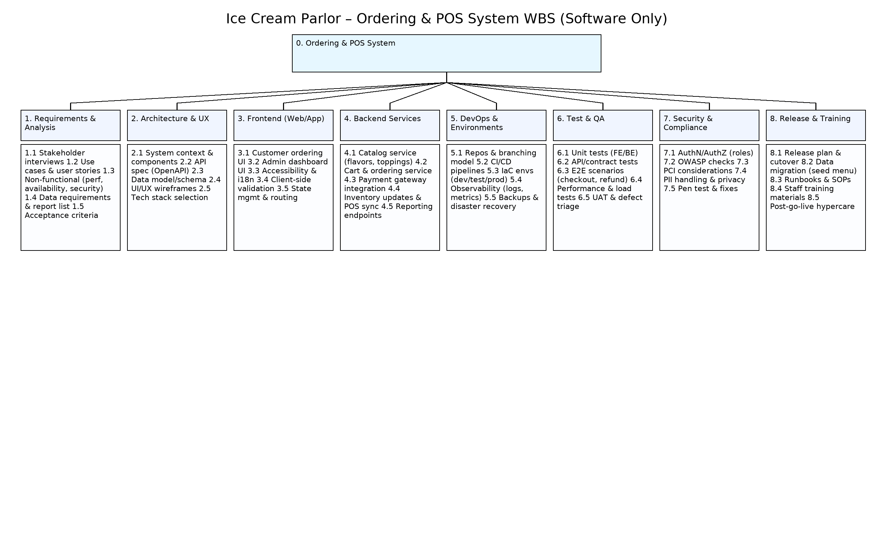
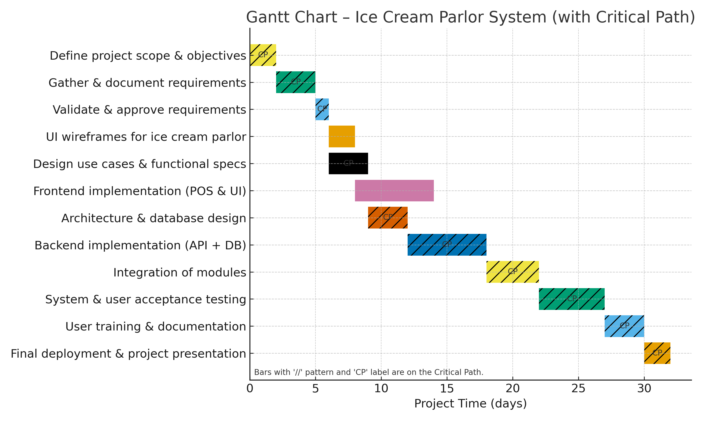
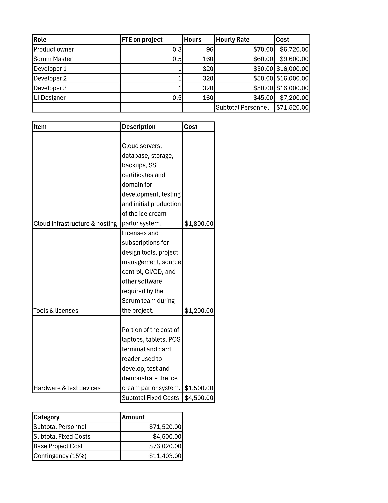
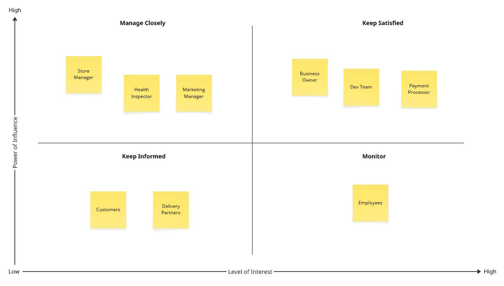
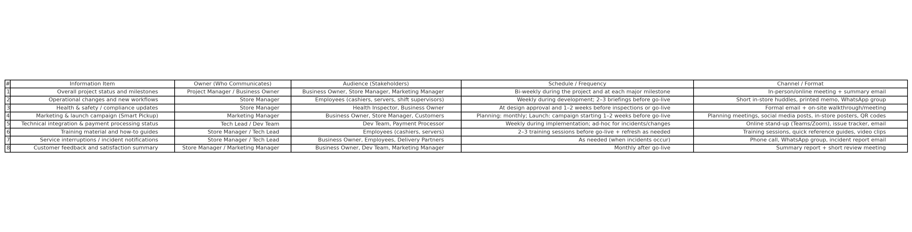
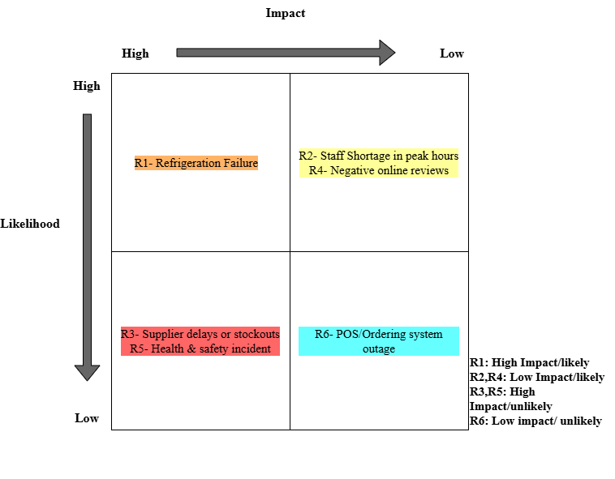

# Ice Cream Parlor Website

## 1. Introduction

This projects goal is to create and design a website for a ice cream parlor. It will include a ordering system where users/customers can order Ice cream and have it delivered to their location. The website also includes a menu where users can browse ice cream flavors, prices and other nesscary details. The website would also include tools for admins to add/remove items from the menu to ensure the menu is updated with the inventory.

*October 7th, 2023*

*Current Version: 1.0*

Project Collorbarators: Reni Zani, Hrishikesh Dipak Desai, Kevin Jose Ortega Taveras

## 2. Overview

We plan to develop a website for a ice cream parlor to organize inventory, menus and orders.

### 2.1 Objective

A website designed for managing and displaying a menu with updated details of ice cream flavors and prices in respect to the ice cream parlors inventory

### 2.2 Objective

The website manages and allows user to create orders for ice cream that will be delivered to their location, while orders being tied to their authenticated account

### 2.3 Objective

A website that allows admin control to update the menu to ensure the menu is following the inventory information

## 3. Milestones
1. List of technological choices for front-end, back-end, database, and hosting/domain defined
2. Website back-end implemented and front-end design with static test pages completed in development environment
3. Customer ordering system designed and tested for placing and tracking ice cream orders
4. Admin tool for managing menu items (add, update, remove) designed and tested
5. Menu display with real-time inventory updates integrated and verified in development environment
6. User authentication and profile management implemented and tested
7. Final integrated system deployed to hosting environment and ready for presentation

### 3.1 Work Breakdown Structure

### 3.2 Requirements Traceability Matrix

| Req ID | Requirement | Del ID | Deliverable | Owner | Status |
|---------|-------------|--------|--------------|--------|--------|
| REQ01 | Database schema created and linked with Node.js | DEL01 | Functional connection between Supabase and back end | Kevin | Pending |
| REQ02 | Menu display connected to database | DEL02 | Dynamic menu displaying flavors, categories, and prices | Hrishikesh | Pending |
| REQ03 | Order creation and management implemented | DEL03 | Users can place and manage orders tied to their account | Kevin & Hrishikesh | Pending |
| REQ04 | Admin feature to update menu | DEL04 | Admins can add/remove items from the menu | Reni | Pending |
| REQ05 | Deployment completed | DEL05 | Website deployed successfully to Vercel | Team | Pending |

---

## 4. Deliverables
1. Fully functional ice cream parlor website with online ordering.  
2. Dynamic menu page connected to live inventory data.  
3. Admin panel for managing products and updating menu items.  
4. Inventory tracking system integrated with ordering.  
5. Final tested and deployed version hosted on Vercel with documentation.

### 4.1 Gantt Chart

---

## 5. Preliminary Budget 

## 6. Organization, Stakeholders & Communication Plan

## 7. Risks, Assumptions, and Constraints - Leave Empty

